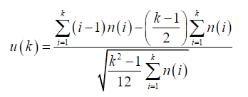

# Laplace Trend Test tool

## Background

The use of the Laplace trend test is to see if the system reliability is increasing, decreasing, or stable.

The Laplace trend test for failure count is calculated using the following formula:



Negative values of u(k) indicates that reliability growth is decreasing.

Positive values of u(k) indicates that reliability growth is increasing.

Values between -2 and +2 indicate that the reliability growth is stable.

## How to run

```cmd
python laplaceTrendTest.py <file path>
```

### File Formats

File to run the trend test on has to be in either of the following formats.

#### Failure Count

```csv
T,FC
1,2
2,3
3,4
```

Both columns T and FC need to be able to convert to numpy.float32.
